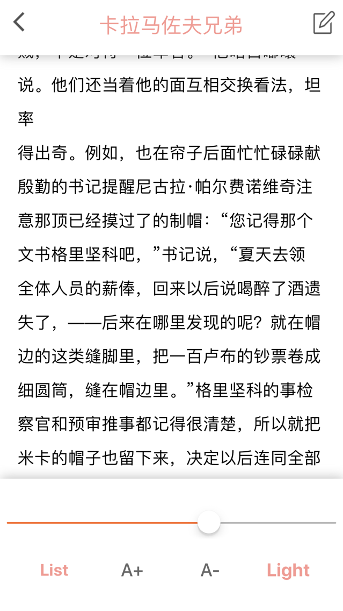
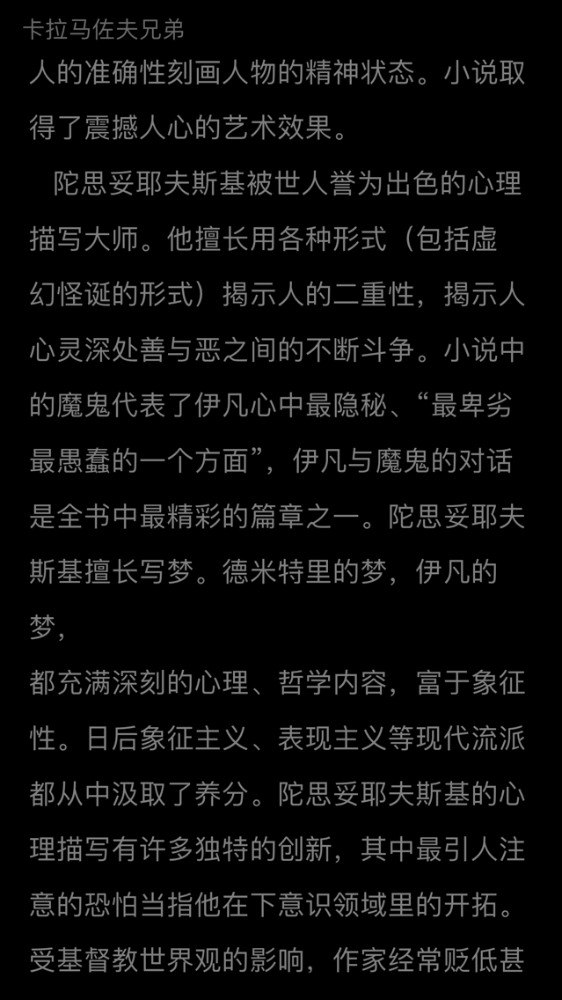
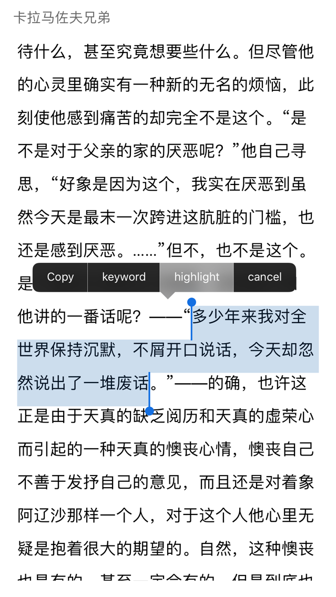
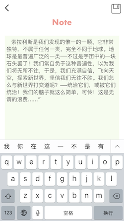
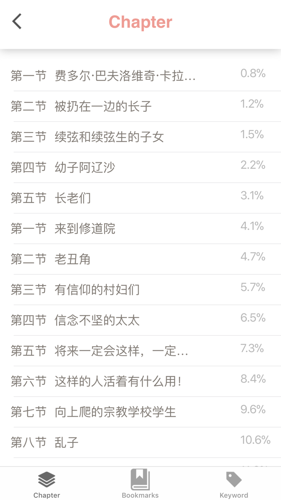
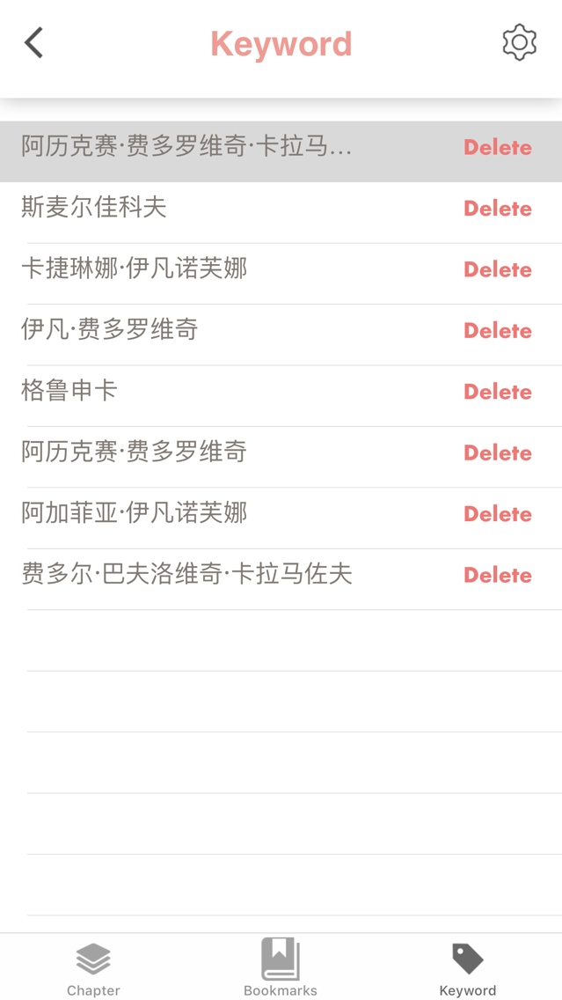
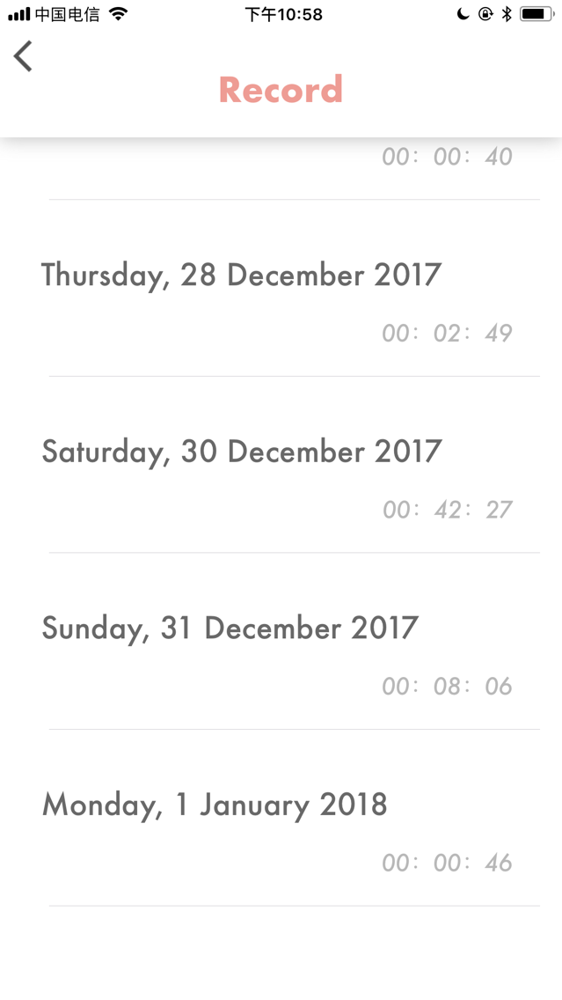

# MyReadit
# Readit 电子阅读器
## 实现功能
## 首页
 

* 进入时直接刷新文件书目，加入新书，删除旧书
* 点击书名(右边列表)进入阅读界面
* 点击MyDailyRecords(红色那条)进入统计界面
 

## 阅读界面

* 调整字体大小，夜间日间模式切换，进度条跳转

* 夜间模式

* 长按文字选择高亮（书签），关键词，复制

* 点击右上图标记笔记
* 记笔记界面

* 左下进入List界面

## List界面

 * 章节根据正则匹配进行分析，支持点击跳转

 * 书签浏览，点击跳转，点击右上进行删除操作

 * 关键词浏览，点击进行补充，点击右上进行删除操作

* 关键词描述补充界面

## 统计界面
 * 显示每天读书时间

## 数据持久化
 * 每本书的书签，关键词将保留在文件中，打开时从文件加载
 * 存储每天阅读记录

